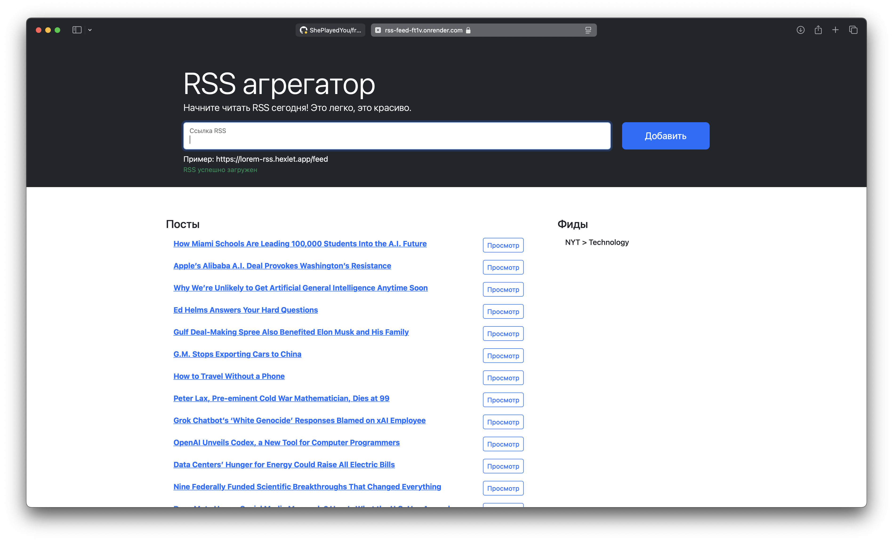
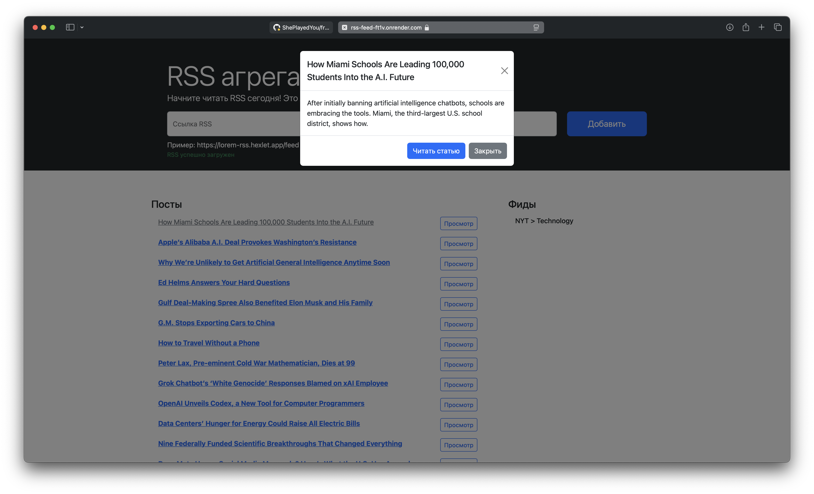

### Hexlet tests and linter status:
[](https://github.com/ShePlayedYou/frontend-project-11/actions)

### RSS Feed service live on Render.com: <https://rss-feed-ft1v.onrender.com>

**RSS Reader** — это сервис для агрегации RSS-потоков. Он позволяет добавлять неограниченное количество потоков, автоматически обновлять каждые 5 секунд и отображать новые публикации в удобном формате.

### Используемые технологии
1. JavaScript - yup, axios, onChange, Promises
2. CI/CD - Render, GitHub Actions
3. Тестирование - EsLint
4. Сборка - Webpack
5. Дизайн и вёрстка - Bootstrap 5
6. Локализация интерфейса - i18next

### Описание
Приложение реализует клиентский RSS-агрегатор с поддержкой следующих функций:
1. Добавление RSS-лент по URL. Перед загрузкой выполняется валидация:
- на корректность URL-адреса (валидный формат);
- на наличие валидного RSS-фида;
- на отсутствие дублирующейся ссылки (один и тот же фид нельзя добавить дважды).
2. Обратная связь пользователю реализована в виде уведомлений:
- об ошибках валидации;
- сетевых ошибках;
- успешной загрузке RSS-ленты.
3. Автоматическое обновление фидов каждые 5 секунд с использованием axios. При наличии новых публикаций они добавляются в список без перезагрузки страницы.
4. Посты от всех фидов агрегируются в общий поток. Поддерживается неограниченное количество RSS-источников.
5. Для каждой публикации доступны:
- переход по ссылке к оригинальному источнику;
- предварительный просмотр содержимого в модальном окне (используется компонент Modal от Bootstrap 5).
6. Прочитанные публикации визуально выделяются — ссылка теряет жирное начертание (fw-normal вместо fw-bold).
7. Хранилище состояния реализовано на клиенте с помощью on-change. Все данные (фиды и посты) существуют только в пределах текущей сессии и очищаются при обновлении страницы.

### Скриншоты



### Локальный запуск
1. Клонируйте репозиторий к себе на компьютер
2. Перейдите в корневую директорию проекта
3. Установите зависимости проекта, выполнив в консоли команду 
    ```
    make install
    ```
4. Запустите проект через Webpack, выполнив команду 
    ```
    make run
    ```